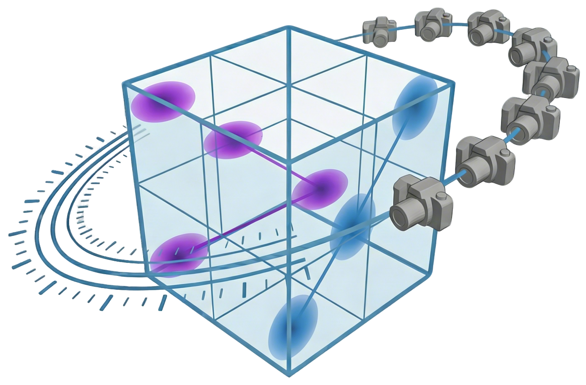
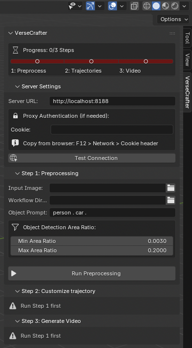
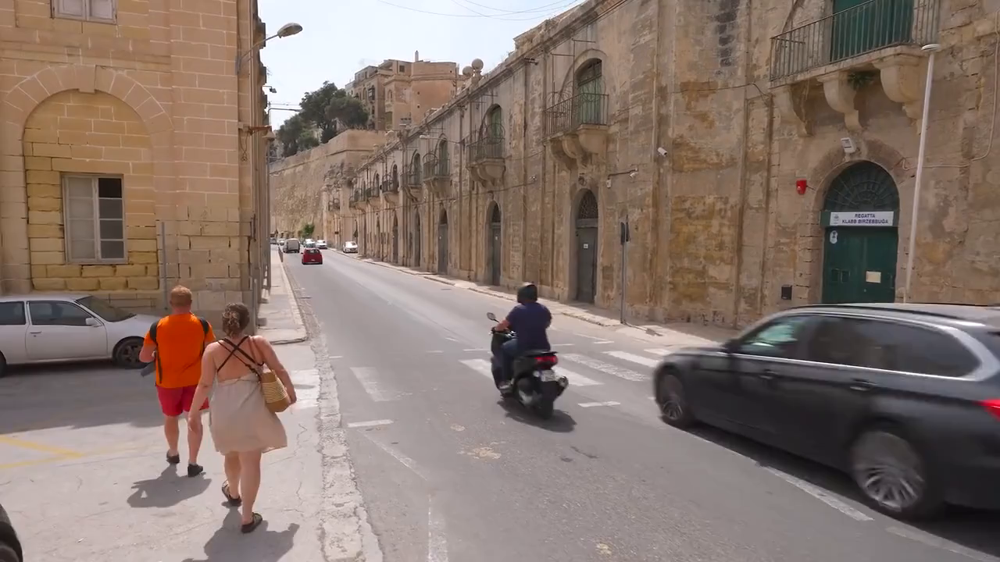
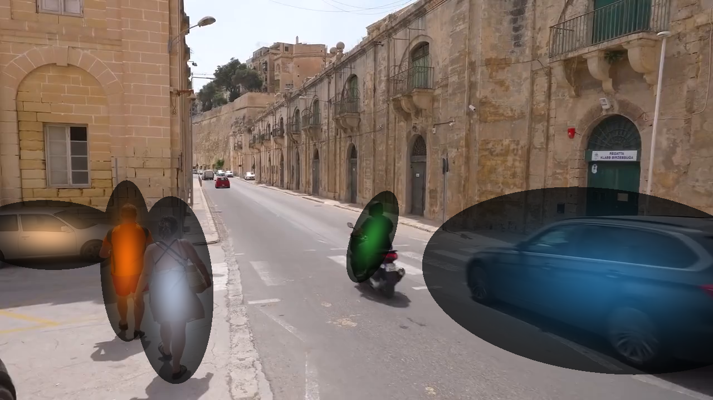
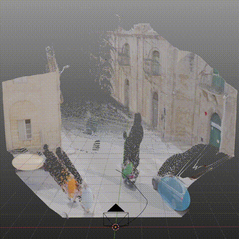
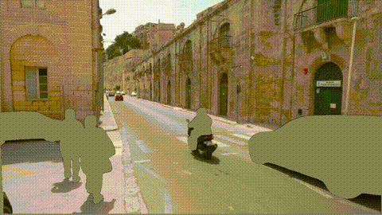
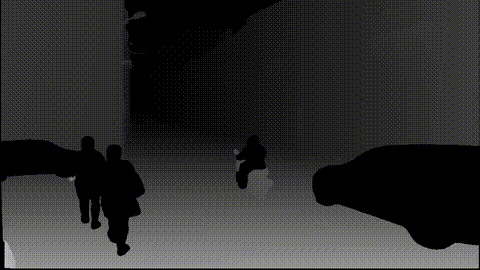
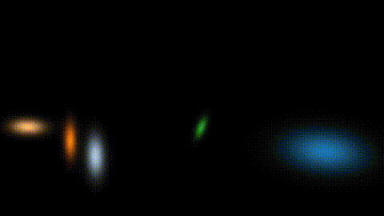
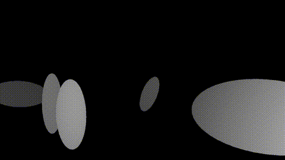
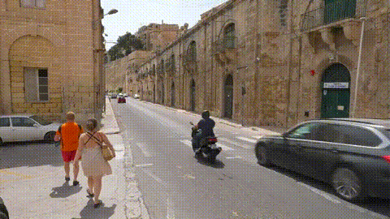

<p align="center">
  
</p>

<h2 align="center"> 
  <a href="INSERT_ARXIV_LINK">
    VerseCrafter: Dynamic Realistic Video World Model with 4D Geometric Control
  </a>
</h2>

<a href="https://arxiv.org/pdf/2601.05138"></a>&nbsp;
<a href="https://github.com/TencentARC/VerseCrafter"></a>&nbsp;
<a href="https://huggingface.co/TencentARC/VerseCrafter"></a>&nbsp;
<a href="https://sixiaozheng.github.io/VerseCrafter_page/"></a>&nbsp;

<p align="center">
  <a href="https://sixiaozheng.github.io/">Sixiao Zheng</a><sup>1,2</sup> &nbsp;&nbsp;
  <a href="#">Minghao Yin</a><sup>3</sup> &nbsp;&nbsp;
  <a href="https://wbhu.github.io/">Wenbo Hu</a><sup>4†</sup> &nbsp;&nbsp;
  <a href="https://xiaoyu258.github.io/">Xiaoyu Li</a><sup>4</sup> &nbsp;&nbsp;
  <a href="https://www.linkedin.com/in/YingShanProfile">Ying Shan</a><sup>4</sup> &nbsp;&nbsp;
  <a href="https://yanweifu.github.io/">Yanwei Fu</a><sup>1,2†</sup>
</p>

<p align="center">
  <sup>1</sup>Fudan University &nbsp;&nbsp; <sup>2</sup>Shanghai Innovation Institute &nbsp;&nbsp; <sup>3</sup>HKU &nbsp;&nbsp; <sup>4</sup>ARC Lab, Tencent PCG
</p>

<p align="center">
  <sup>†</sup>Corresponding authors
</p>

✨ A controllable video world model with explicit 4D geometric control over camera and multi-object motion.

## TL;DR

- **Dynamic Realistic Video World Model**: VerseCrafter learns a realistic and controllable video world prior from large-scale in-the-wild data, handling challenging dynamic scenes with strong spatial-temporal coherence.
- **4D Geometric Control**: A unified 4D control state provides direct, interpretable control over camera motion, multi-object motion, and their joint coordination, improving geometric faithfulness.
- **Frozen Video Prior + GeoAdapter**: We attach a geometry-aware GeoAdapter to a frozen Wan2.1 backbone, injecting 4D controls into diffusion blocks for precise control without sacrificing video quality.
- **VerseControl4D Dataset**: We introduce a large-scale real-world dataset with automatically rendered camera trajectories and multi-object 3D Gaussian trajectories to supervise 4D controllable generation.

## Installation

1. **Clone the repository:**

   ```bash
   git clone --recursive https://github.com/TencentARC/VerseCrafter.git
   # If you have already cloned the repo, you can update the submodules manually:
   git submodule update --init --recursive

   cd VerseCrafter
   ```
2. **Create and activate the Conda environment:**

   ```bash
   conda create -n versecrafter python=3.11 -y
   conda activate versecrafter

   # Install PyTorch
   conda install pytorch==2.3.0 torchvision==0.18.0 torchaudio==2.3.0 pytorch-cuda=12.1 -c pytorch -c nvidia -y 

   # Install Python dependencies
   pip install -r requirements.txt

   # Install MoGe
   pip install git+https://github.com/microsoft/MoGe.git

   # Install Grounded-SAM-2
   cd inference/Grounded-SAM-2
   pip install -e .
   pip install --no-build-isolation -e grounding_dino

   # Install flash attention
   pip install flash-attn --no-build-isolation

   # Install pytorch3d
   cd ../../
   git clone https://github.com/facebookresearch/pytorch3d.git
   cd pytorch3d
   pip install --no-build-isolation .
   cd ../VerseCrafter
   ```

## Download Checkpoints

1. **Download VerseCrafter and Wan2.1 models:**

   ```bash
   pip install --upgrade huggingface_hub
   mkdir -p model
   hf download --local-dir model/VerseCrafter sxzheng/VerseCrafter
   hf download --local-dir model/Wan2.1-T2V-14B Wan-AI/Wan2.1-T2V-14B
   ```
2. **Download Grounded-SAM-2 and Grounding DINO checkpoints:**

   ```bash
   cd third_party/Grounded-SAM-2/checkpoints
   bash download_ckpts.sh

   cd ../gdino_checkpoints
   bash download_ckpts.sh
   cd ../../../
   ```

## Usage

We provide two ways to use VerseCrafter:

| Method | Description | Pros | Cons |
|--------|-------------|------|------|
| **Blender Addon** | Deploy API server on GPU machine, call models directly from Blender | One-stop workflow, no context switching, visual trajectory editing | Requires network access to GPU server |
| **Script Pipeline** | Run each step manually via command line | Works offline, full control over each step | Requires manual switching between terminal and Blender |

> **💡 Tip**: We recommend the **Blender Addon** for most users. It supports proxy authentication for secure server access. If you cannot connect to a remote GPU server, use the **Script Pipeline** instead.

---

### Option 1: Blender Addon (Recommended)




For detailed instructions, see [README_BLENDER.md](README_BLENDER.md).

#### Prerequisites

- Blender 4.0+ (4.5+ recommended)
- A remote GPU server running the VerseCrafter API

#### Quick Start

1. **Install the addon**:

   ```bash
   cd VerseCrafter
   zip -r blender_addon.zip blender_addon/
   ```
   
   In Blender: Edit → Preferences → Add-ons → ↓ → Install from Disk... → Select `blender_addon.zip` → Enable "VerseCrafter Workflow"

2. **Start the API server** (on GPU server):

   ```bash
   python api_server.py --port 8188 --num_gpus 8
   ```

3. **Configure connection** in Blender:
   - Press `N` to open the sidebar → VerseCrafter tab
   - Set **Server URL** (e.g., `http://<server-ip>:8188`)
   - Click **Test Connection**

4. **Run the workflow**:
   - **Step 1**: Select input image, set workflow directory, enter object prompt (e.g., "person . car ."), click "Run Preprocessing"
   - **Step 2**: Edit camera and object trajectories visually, click "Export Trajectories"  
   - **Step 3**: Enter video prompt, click "Generate Video"


---

### Option 2: Script Pipeline

The `inference.sh` script provides a complete pipeline for generating videos. You can run the steps individually or use the script as a reference.

#### 1. Configuration

Edit `inference.sh` to set your input image, output directory, and prompt.

```bash
INPUT_IMAGE=demo_data/y57HgqX1uGc_0039750_0041550_0000635_0000716/0001.jpg
OUTPUT_DIR=demo_data/y57HgqX1uGc_0039750_0041550_0000635_0000716
MODEL_PATH="model/VerseCrafter"
```

#### 2. Run the Pipeline

The pipeline consists of the following steps:

##### Step 1: Depth Estimation

Generate depth maps using MoGE-V2.

```bash
python inference/moge-v2_infer.py  -i $INPUT_IMAGE -o $OUTPUT_DIR/estimated_depth --maps
```

##### Step 2: Segmentation

Segment objects using Grounded-SAM-2.

```bash
python inference/grounded_sam2_infer.py \
    --image_path "$INPUT_IMAGE" \
    --text_prompt "person . car ." \
    --output_dir "$OUTPUT_DIR/object_mask" \
    --min_area_ratio 0.003 \
    --max_area_ratio 0.2
```

##### Step 3: Fit 3D Gaussian

Fit 3D Gaussians to the segmented objects.

```bash
python inference/fit_3D_gaussian.py \
    --image_path $INPUT_IMAGE \
    --npz_path $OUTPUT_DIR/estimated_depth/depth_intrinsics.npz \
    --masks_dir $OUTPUT_DIR/object_mask/masks \
    --output_dir $OUTPUT_DIR/fitted_3D_gaussian
```

The following are input image and its corresponding results:

| Input Image | Depth Map | Segmentation Mask | 3D Gaussian |
|-------------|-----------|-------------------|-------------|
||| ||

##### Step 4: Customize Trajectory (Manual Operation in Blender)

This step requires **Blender** to interactively edit the 4D control scene. We also provide a demonstration video that shows step-by-step Blender operations for this process:  
[Watch the Blender operation video here](https://www.bilibili.com/video/BV1xxxxxxx)

1. **Prepare Scripts**:

   * Open `inference/blender_script/build_4d_control_scene.py` and `inference/blender_script/export_blender_custom_trajectories.py`.
   * **Crucial**: Update the `ROOT_DIR` variable in both scripts to the **absolute path** of your input directory (e.g., `/absolute/path/to/demo_data/your_folder`).

2. **Build Scene**:

   * Open Blender.
   * Go to the **Scripting** tab.
   * Open or paste the content of `build_4d_control_scene.py`.
   * Run the script to load the scene (point cloud, camera, objects).

3. **Customize Trajectories**:

   * Switch to the **Layout** tab.
   * **Camera Trajectory**:
     * Create a curve (e.g., `Shift+A` → Curve → Bezier).
     * Switch to **Edit Mode** to draw or adjust the curve.
     * Select the Camera, add a **Follow Path** constraint targeting the curve.
     * Check **Fixed Position**.
     * Set the animation duration to **81 frames**.
   * **3D Gaussian (Object) Trajectory**:
     * Select the object (Ellipsoid).
     * Use the same **Follow Path** method as the camera, or insert **Keyframes** (`I` key) for location/rotation/scale.

4. **Export Trajectories**:

   * Go back to the **Scripting** tab.
   * Open or paste the content of `export_blender_custom_trajectories.py`.
   * Run the script to export `custom_camera_trajectory.npz` and `custom_3D_gaussian_trajectory.json`.

This is an animation of custom trajectories in Blender:

   

##### Step 5: Render 4D Control Maps

Render the 4D control maps for the diffusion model.

```bash
python inference/rendering_4D_control_maps.py \
    --png_path $INPUT_IMAGE \
    --npz_path $OUTPUT_DIR/estimated_depth/depth_intrinsics.npz \
    --mask_dir $OUTPUT_DIR/object_mask/masks \
    --trajectory_npz $OUTPUT_DIR/camera_object_0/custom_camera_trajectory.npz \
    --ellipsoid_json $OUTPUT_DIR/camera_object_0/custom_3D_gaussian_trajectory.json \
    --output_dir $OUTPUT_DIR/camera_object_0/rendering_4D_maps
```

The following are 4D control maps rendered from the this steps:

| Background RGB | Background Depth | 3D Gaussian RGB | 3D Gaussian Depth | Merged Mask |
|:--------------:|:--------------:|:--------------:|:--------------:|:--------------:|
||||||


##### Step 6: VerseCrafter Inference

Generate the generated video.

```bash
torchrun --nproc-per-node=8 inference/versecrafter_inference.py \
  --transformer_path $MODEL_PATH \
  --num_inference_steps 30 \
  --sample_size "720,1280" \
  --ulysses_degree 2 \
  --ring_degree 4 \
  --prompt "A sun-drenched street in Valletta, Malta, showcasing towering honey-colored limestone buildings adorned with traditional wrought-iron balconies and arched doorways. On the left-hand sidewalk, a man in a bright orange T-shirt and a woman in a beige summer dress walk side-by-side. Several cars are parked in the distance. The vibrant Mediterranean sunlight casts soft shadows, illuminating the weathered textures of the ancient architecture, which stretches towards distant city fortifications under a clear, pale blue sky." \
  --input_image_path $INPUT_IMAGE \
  --save_path $OUTPUT_DIR/camera_object_0 \
  --rendering_maps_path $OUTPUT_DIR/camera_object_0/rendering_4D_maps
```



## Acknowledgements

Our codes are built upon  [MoGe](https://github.com/microsoft/MoGe), [Grounded-SAM-2](https://github.com/IDEA-Research/Grounded-SAM-2), [VideoX-Fun](https://github.com/aigc-apps/VideoX-Fun),  [Wan2.1](https://github.com/Wan-Video/Wan2.1) and [diffusers](https://github.com/huggingface/diffusers).

## License

This project is released under the [VerseCrafter License](LICENSE). It is intended for **academic/research purposes only** and commercial use is not permitted.

## Citation

If you find this work useful, please consider citing:

```bibtex
@article{zheng2026versecrafter,
  title={VerseCrafter: Dynamic Realistic Video World Model with 4D Geometric Control},
  author={Zheng, Sixiao and Yin, Minghao and Hu, Wenbo and Li, Xiaoyu and Shan, Ying and Fu, Yanwei},
  journal={arXiv preprint arXiv:2601.05138},
  year={2026}
}
```