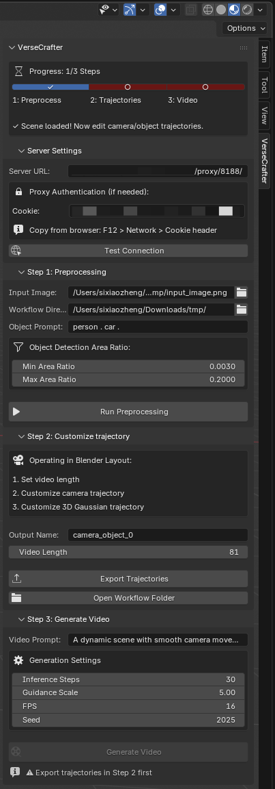
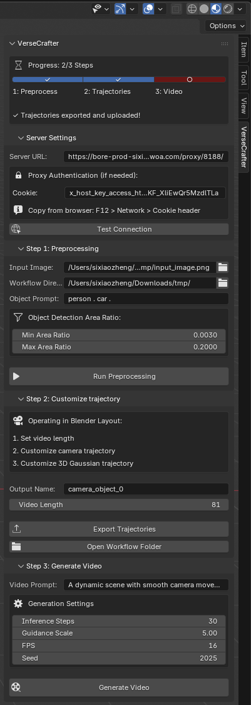
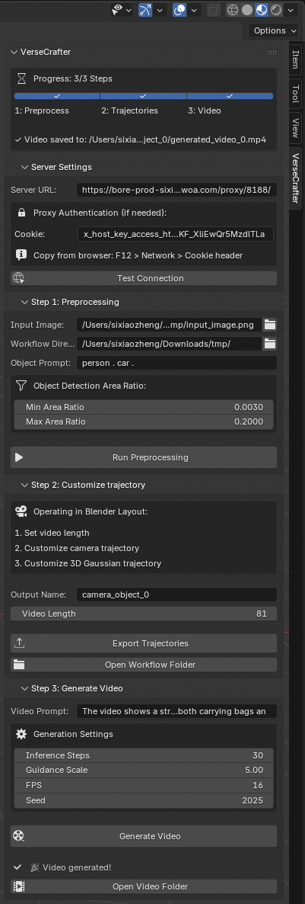

# VerseCrafter Blender Addon

A Blender addon that provides a seamless workflow for VerseCrafter video generation, with automatic file transfer between your local machine and a remote GPU server.

## Features

- **One-Click Preprocessing**: Upload image to server, run depth estimation, segmentation, and 3D Gaussian fitting on GPU, download results automatically
- **3D Scene Visualization**: View point cloud and 3D Gaussian ellipsoids directly in Blender
- **Trajectory Editing**: Edit camera and object trajectories using Blender's animation tools
- **One-Click Video Generation**: Render control maps and generate video on GPU server, download result automatically
- **Proxy Support**: Works with authenticated proxy servers (cookie-based authentication)
- **Progress Tracking**: Real-time status updates and progress display

## Requirements

### Blender Side
- Blender 4.0+ (4.5+ recommended)
- Python packages (usually pre-installed with Blender):
  - numpy
  - opencv-python
  - matplotlib

### Server Side
- NVIDIA GPU with CUDA
- Python 3.10+
- All VerseCrafter dependencies
- Flask (`pip install flask flask-cors`)

## Installation

1. In the `VerseCrafter` project folder, run:
   ```bash
   zip -r blender_addon.zip blender_addon/
   ```
2. In Blender: Edit → Preferences → Add-ons → ↓ → Install from Disk...
3. Select `blender_addon.zip`
4. Enable "VerseCrafter Workflow"

## Usage

### Start the API Server (on GPU Server)

SSH to your GPU server and run (if you have multiple GPUs, use `--num_gpus` to specify the number):
```bash
cd /path/to/VerseCrafter
python api_server.py --port 8188 --num_gpus 8
```

### Configure Server Connection

1. Open Blender
2. Go to Layout → Sidebar (N key) → VerseCrafter tab
3. Expand **Server Settings** panel
4. Set the **Server URL**:
   - For direct access: `http://<server-ip>:8188`
   - For proxy access: `https://your-proxy-url/proxy/8188`
5. (Optional) If using proxy authentication, paste your **Cookie** from browser (F12 → Network → 8188/ → Request Header → Cookie)
6. Click **Test Connection** to verify


### Step 1: Run Preprocessing

1. Expand **Step 1: Preprocessing** panel
2. **Input Image**: Browse to select a local image
3. **Workflow Directory**: Set a local folder for intermediate files
4. **Object Prompt**: Enter objects to detect (e.g., "person . car .")
5. (Optional) Adjust **Min/Max Area Ratio** to filter out objects that are too small or too large
6. Click **"Run Preprocessing"**

After completion, you'll see:
- A colored point cloud representing the scene
- Colored ellipsoids representing detected objects
- A camera at the origin



### Step 2: Customize Trajectories

We also provide a demonstration video that shows step-by-step Blender operations for this process:  
[Watch the Blender operation video here](https://www.bilibili.com/video/BV1xxxxxxx)


1. Expand **Step 2: Customize Trajectory** panel
2. Set **Video Length** (number of frames, default: 81)
3. **Customize camera trajectory**:
4. **Customize 3D Gaussian trajectory**:
5. Set **Output Name** (default: `camera_object_0`)
6. Click **"Export Trajectories"**



### Step 3: Generate Video

1. Expand **Step 3: Generate Video** panel
2. Set the **Video Prompt** describing the desired video
3. Adjust generation settings:
   - **Inference Steps**: Diffusion steps (default: 30)
   - **Guidance Scale**: CFG scale (default: 5.0)
   - **FPS**: Output video framerate (default: 16)
   - **Seed**: Random seed for reproducibility
4. Click **"Generate Video"**



## Workflow Directory Structure

After processing, your workflow directory will contain:
```
workflow_directory/
├── input_image.png              # Copied from your selected image
├── estimated_depth/
│   └── depth_intrinsics.npz     # Depth and camera intrinsics
├── fitted_3D_gaussian/
│   └── gaussian_params.json     # 3D Gaussian parameters
└── camera_object_0/             # Your exported trajectory
    ├── custom_camera_trajectory.npz
    ├── custom_3D_gaussian_trajectory.json
    └── generated_video_0.mp4    # Final output video
```

